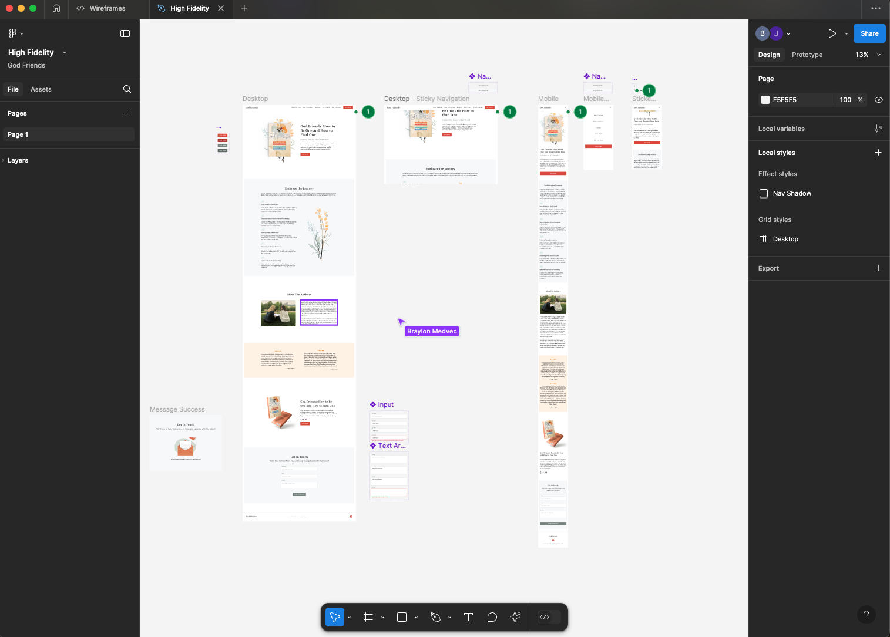
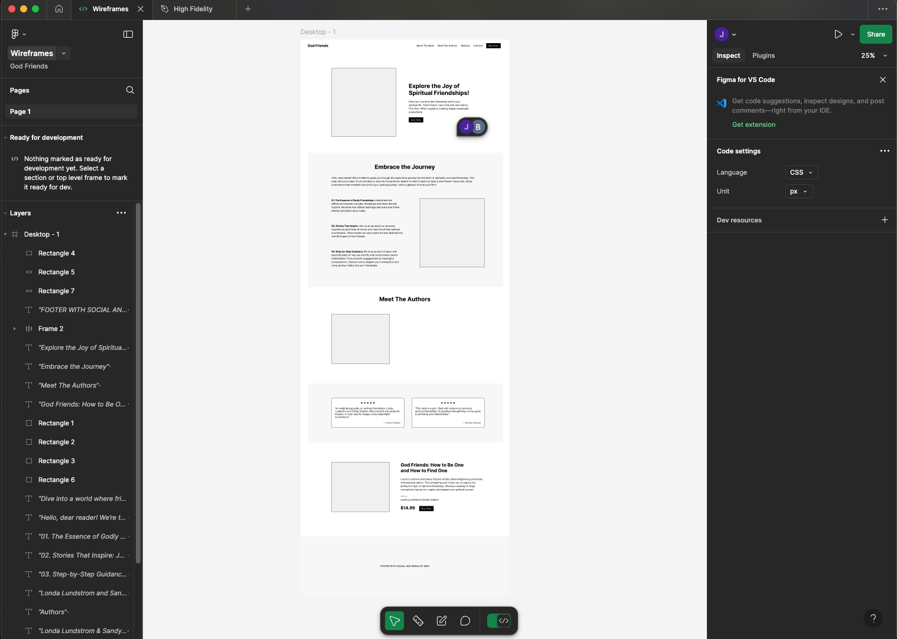
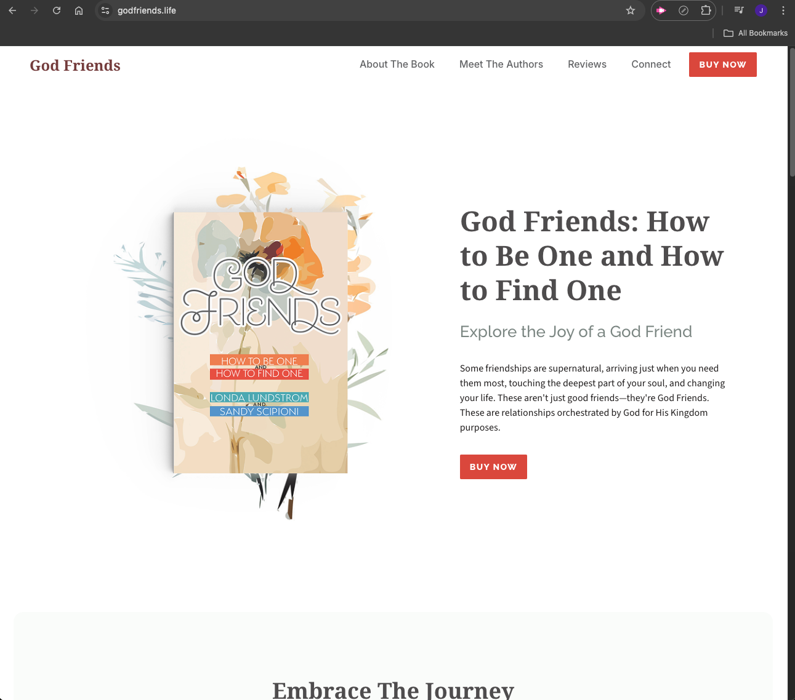
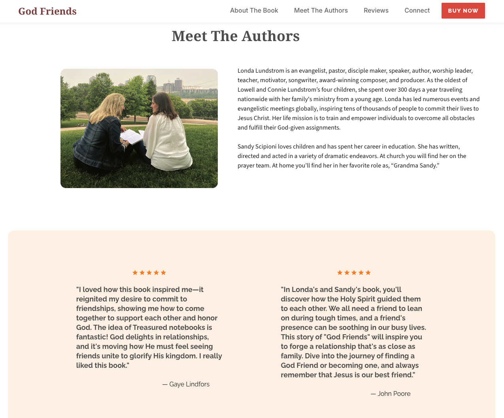
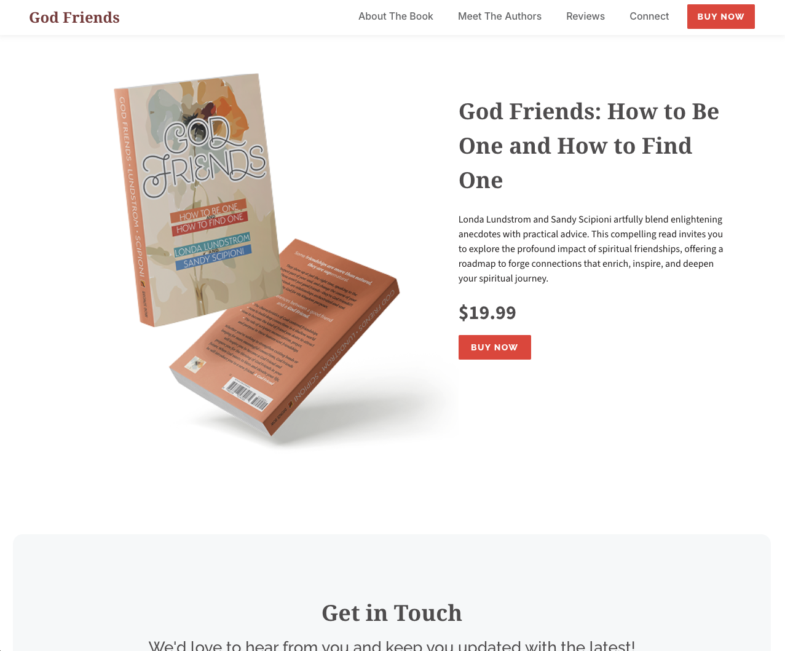
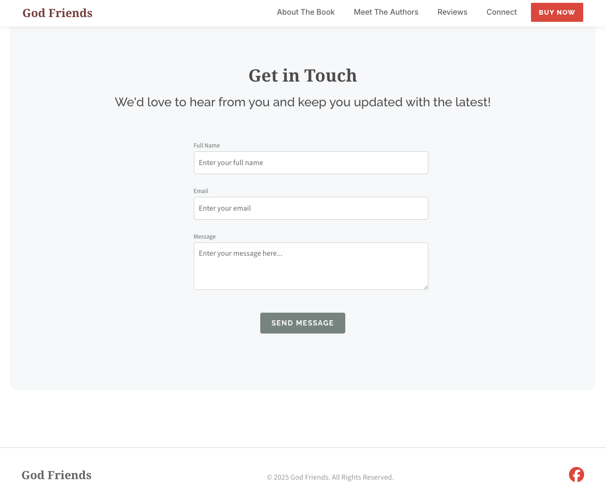
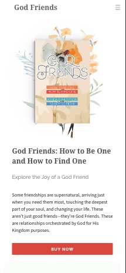
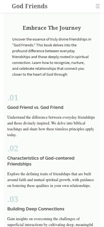
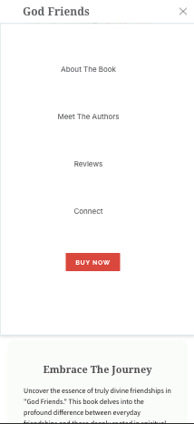
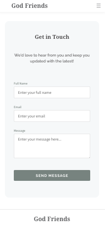

# God Friends Web Page

God Friends is a beautifully designed and responsive web page that highlights the book **"God Friends"** by Londa Lundstrom and Sandy Scipioni. This project marks my first **live** development launch, where I worked closely with a designer to achieve a **pixel-perfect** implementation using **Figma**.

## 🚀 Live Website
[GodFriends](https://godfriends.life/)

## 📌 Features
- **Responsive Design**: The layout adapts seamlessly to different screen sizes.
- **Pixel-Perfect Implementation**: Developed closely following a **Figma** design.
- **Meet the Authors Section**: Showcasing Londa and Sandy with biographies.
- **Ratings & Reviews**: Displaying testimonials from readers.
- **Optimized Performance**: Ensuring fast loading and smooth interactions.

## 🛠️ Tech Stack
- **Frontend**: React, TypeScript
- **Styling**: CSS
- **Design Collaboration**: Figma

## 📖 Lessons Learned
- **Working with a Designer**: Ensuring accuracy between design and development.
- **Responsive Development**: Handling different screen sizes and layouts.
- **Performance Optimization**: Ensuring fast and smooth UI.
- **Deploying a Live Project**: Managing assets, hosting, and optimizations.

## 📷 Screenshots

### 🎨 Figma Designs
---


---


---

### 🌐 Web Layout
---


---


---


---


---



---

### 📲 Mobile Layout
---


---



---


---


---


---



---



---

## 📂 Project Structure
```
├── public
│   ├── book-alt-img.png
│   └── flower-god-friends.png
├── src
│   ├── App.tsx
│   ├── assets
│   │   ├── Author-god-friends.png
│   │   ├── Facebook.png
│   │   ├── OpenHamburger.png
│   │   ├── Stars.png
│   │   ├── book-alt-img.png
│   │   ├── book-hero-image.png
│   │   ├── close.png
│   │   ├── flower-god-friends.png
│   │   └── success.png
│   ├── components
│   │   ├── Authors.tsx
│   │   ├── ContactForm.tsx
│   │   ├── Embrace.tsx
│   │   ├── Explore.tsx
│   │   ├── FinalCTA.tsx
│   │   ├── Footer.tsx
│   │   ├── LottieAnimation.tsx
│   │   ├── Navbar.tsx
│   │   └── Rating.tsx
│   ├── main.tsx
│   ├── styles
│   │   └── index.css
│   └── vite-env.d.ts
├── tsconfig.app.json
├── tsconfig.json
├── tsconfig.node.json
└── vite.config.ts
```

## 📌 How to Run Locally
1. Clone the repository:
   ```sh
   git clone [repo-link]
   ```
2. Navigate into the project directory:
   ```sh
   cd god-friends
   ```
3. Install dependencies:
   ```sh
   npm install
   ```
4. Start the development server:
   ```sh
   npm run dev
   ```

## 🎉 Acknowledgments
- Special thanks to **Londa Lundstrom** and **Sandy Scipioni** for the opportunity to work on this amazing project! <br>
- A special thanks to **Braylon Medvec** for his clean and professional design, along with showing me the ropes of Figma!
---
🔗 <br>
 **Follow my journey** on [LinkedIn](https://www.linkedin.com/in/joshua-askew-0293bb338/) and stay tuned for more projects! <br>
**Follow me on:** [GitHub](https://github.com/JoshAskew)
